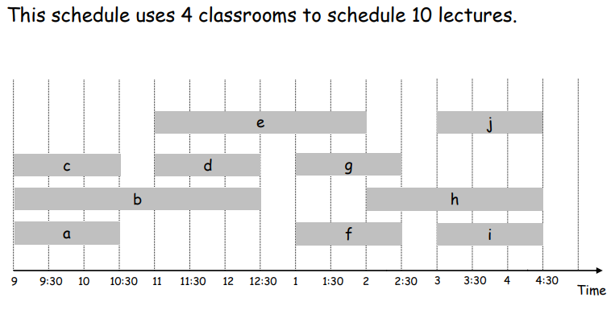
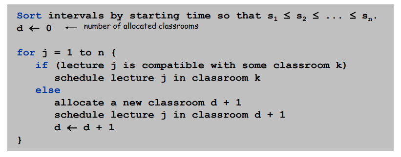
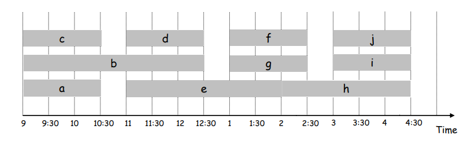

# Interval partitioning - Greedy Algorithm

This implementation, which uses Java, consists in solving the interval partitioning problem using greedy algorithm.

In greedy algorithm problem, there is problem is known as interval partitioning problem and it goes like: There are n lectures to be schedules and there are 
certain number of classrooms. Each lecture has a start time si and finish time fi. Task is to schedule all lectures in minimum number of classes and there 
cannot be more than one lecture in a classroom at a given point of time. 

- Lecture j starts at Sj and finishes at Fj.
- Goal: find minimum number of classrooms to schedule all lectures so that no two occur at the same time in the same room (ignore overlap at start/finish).

## Problem

The lectures are inserted into a CSV file (https://github.com/dudursn/interval-partitioning-greedy-algorithm/blob/main/data/lectures.csv)

    name, startTime, finishTime
    d,11:00,12:30
    b,09:00,12:30
    f,13:00,14:30
    g,13:00,14:30
    h,14:00,16:30
    i,15:00,16:30
    c,09:00,10:30
    e,11:00,14:00
    j,15:00,16:30
    a,09:00,10:30

## Algorithm

    
For sort by starting time, I used a MinHeap through remove function, which get min and remove it.

## Optimal Solution

## My Greedy Alghoritm Solution

    - Classroom{name='class 0'[Lecture{name='b', startTime=09:00, finishTime=12:30}, Lecture{name='f',  startTime=13:00, finishTime=14:30}, Lecture{name='i', startTime=15:00, finishTime=16:30}]}

        Class 0: b,f,i

    - Classroom{name='class 1'[Lecture{name='c', startTime=09:00, finishTime=10:30}, Lecture{name='d',startTime=11:00, finishTime=12:30}, Lecture{name='g', startTime=13:00, finishTime=14:30}, Lecture  {name='j', startTime=15:00, finishTime=16:30}]}
    
        Class 1: c,d,g,j

    - Classroom{name='class 2'[Lecture{name='a', startTime=09:00, finishTime=10:30}, Lecture{name='e',  startTime=11:00, finishTime=14:00}, Lecture{name='h', startTime=14:00, finishTime=16:30}]}
        
        Class 2: a,e,h

## But...
Greedy algorithm is optimal, it never schedules two incompatible lectures in the same classroom, because <b>Exchange argument</b> (http://www.cs.cornell.edu/courses/cs482/2007su/exchange.pdf). Gradually transform any solution to the one found by the greedy  algorithm without hurting its quality.

## Run
For run project, just import java project to your machine and Build+Run. If you want change lectures, start time or finish time, edit the CSV file.

## Technologies

- Java

## Dependencies

- JDK 11
- Maven
- Opencsv v5.3

## References
- https://www.algorithmsandme.com/interval-partitioning-problem/
- http://www-di.inf.puc-rio.br/~mmolinaro/PAA21-2/04greed%20(M).pdf
- http://www.cs.cornell.edu/courses/cs482/2007su/exchange.pdf
